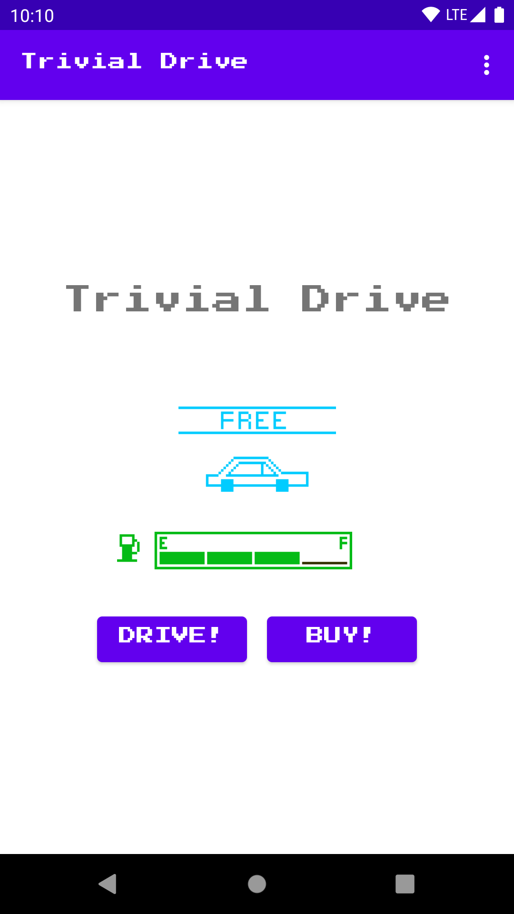
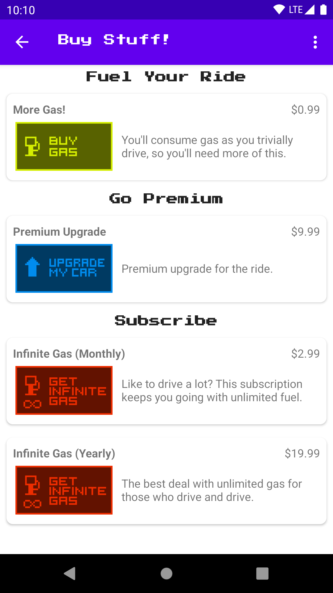

# Trivial Drive (Kotlin)

Sample for Google Play Billing Library version 4

# アプリ仕様
このプロジェクトは、GooglePlay課金ライブラリの使用方法を示すサンプルです。<br>

このアプリは、プレイヤーがガスを購入できるシンプルな「運転」ゲームアプリ。<br>
車にはガスを貯蔵するタンクがあり、プレイヤーが運転するとガスタンク内が減少します（一度に1/4タンク）。<br>
ユーザーは、赤い車を提供する「プレミアムアップグレード」を購入することもできます(アプリ内課金(in app))<br>
ユーザーは、「無限ガス」を購入することもできます。(定期購読(subscription))<br>
その定期購読がアクティブな間、ガスを消費せずに運転することが可能です。<br>
定期購読は　月または年単位で購入できます。<br>

# 前提条件
- [Documentation](https://developer.android.com/google/play/billing/billing_overview.html)

# Screenshots
 <tb> 

# Getting Started
local.propertiesでbase64EncodedPublicKeyを指定しない場合に警告が出るので設定が必要です。<br>
base64EncodedPublicKeyは、購入署名の検証に使用されます。 <br>
GooglePlayデベロッパーコンソールでアプリケーションを作成し、一致するアプリ内購入SKU(購入可能アイテムの一意の識別子)を追加します。<br>
以下に手順を示します。<br>

# GOOGLE PLAY DEVELOPER CONSOLE上の操作


1. 以下のURLにアクアセスして、開発者コンソール上でアプリケーションを作成します<br>
   https://play.google.com/apps/publish/<br>
   


2. アプリケーションの公開鍵（base-64文字列）をコピーします。 収益化のセットアップ->ライセンスから確認可能<br>

   

# プロジェクトのコードを修正する

3. local.propertiesを開いて、 base64EncodedPublicKeyにコピーした値を設定します<br>
   

4. application IDを変更する（R.javaの参照も変更する）<br>
   https://github.com/LeoAndo/play-billing-samples/pull/1

5. 本番用署名ファイルを作成し、その署名ファイルを使ってAPKを作成する

# GOOGLE PLAY DEVELOPER CONSOLE上の操作

6. 内部テストのためにAPKをGooglePlayにアップロードし、テスターを追加する

   これらのアカウントはテスト購入を行うことができます<br>

8. [アプリ内製品]で、次の製品IDを使用して製品を作成します。
   ```
       premium, gas
   ```

9. [サブスクリプション]で、次のIDを使用してSUBSCRIPTIONアイテムを作成します。
   ```
       infinite_gas_monthly, infinite_gas_yearly
   ```

10. APKを内部テストチャネルに公開します。 ほぼすぐにテストする準備ができているはずです。<br>
 
# TEST THE CODE

11. デバッグ証明書で署名されたAPKを、テストアカウントを持つテストデバイスにインストールします。<br>
12. アプリ実行する<br>
13. 課金テストする！<br>

実際に購入した場合は、返金することができます。 内でテスター機能を使用できます<br>
課金されないテストGoogleアカウントを定義するためのGooglePlayコンソール。<br>
テスター機能を使用するときは、それぞれに追加された「テスト」言語を必ず探してください<br>
デバイスのUIとレシートで購入します。 「テスト」が表示されない場合は、必ず返金/キャンセルしてください。<br>

A NOTE ABOUT SECURITY
---------------------

This sample app implements signature verification but does not demonstrate
how to enforce a tight security model. When releasing a production application
to the general public, we highly recommend that you implement the security best
practices described in our documentation at:

https://developer.android.com/google/play/billing/security

In particular, you should set developer payload strings when making purchase
requests and you should verify them when reading back the results. This will make
it more difficult for a malicious party to perform a replay attack on your app.

Support
-------
If you've found an error in this sample, please file an issue:
https://github.com/googlesamples/android-play-billing/issues

Patches are encouraged, and may be submitted by forking this project and
submitting a pull request through GitHub.

License
-------
Copyright 2021 Google, Inc.

Licensed to the Apache Software Foundation (ASF) under one or more contributor
license agreements.  See the NOTICE file distributed with this work for
additional information regarding copyright ownership.  The ASF licenses this
file to you under the Apache License, Version 2.0 (the "License"); you may not
use this file except in compliance with the License.  You may obtain a copy of
the License at

  http://www.apache.org/licenses/LICENSE-2.0

Unless required by applicable law or agreed to in writing, software
distributed under the License is distributed on an "AS IS" BASIS, WITHOUT
WARRANTIES OR CONDITIONS OF ANY KIND, either express or implied.  See the
License for the specific language governing permissions and limitations under
the License.

CHANGELOG
---------

   2012-11-29: Initial release
   2013-01-08: Updated to include support for subscriptions
   2015-03-13: Updated to new dev console and added yearly subscriptions
   2015-08-27: Ported to gradle and prepped for transitioning to GitHub
   2021-04-28: Rewritten and updated to support Google Play Billing Library V3
